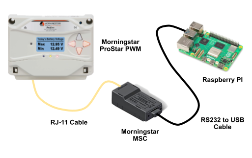

# ProStar Device

Device for monitoring and controlling Morningstar ProStar PWM solar charge controller.

<div align="center">
  


</div>

## Demo

Try the live [demo](https://demo.merliot.net/prostar-01/).  Click the &#x1F4E5; button to see how to build and deploy a prostar device.

<div align="center">

[](https://demo.merliot.net/prostar-01/)

</div>

## Running on Merliot Hub

A [Merliot Hub](https://github.com/merliot/hub) is the easiest way to run the prostar device.

## Run Standalone with Docker

```
git clone https://github.com/merliot/prostar.git
cd prostar
docker build -t prostar .
docker run -p 8000:8000 prostar
```

Now the device is now running in a docker container as a web server, listening on port :8000.  

Browse to http://\<host\>:8000 to view and setup the device.

If the docker host is using https://, pass in the environment variable WS_SCHEME=wss://.

```
docker run -e "WS_SCHEME=wss://" -p 8000:8000 prostar
```

See full list of [environment](https://github.com/merliot/device/blob/main/docs/environment.md) variables.


## Run from Source Code

```
git clone https://github.com/merliot/prostar.git
cd prostar
PORT_PRIME=8000 go run -tags prime ./cmd
```

Browse to http://\<host\>:8000 to view and deploy device.

